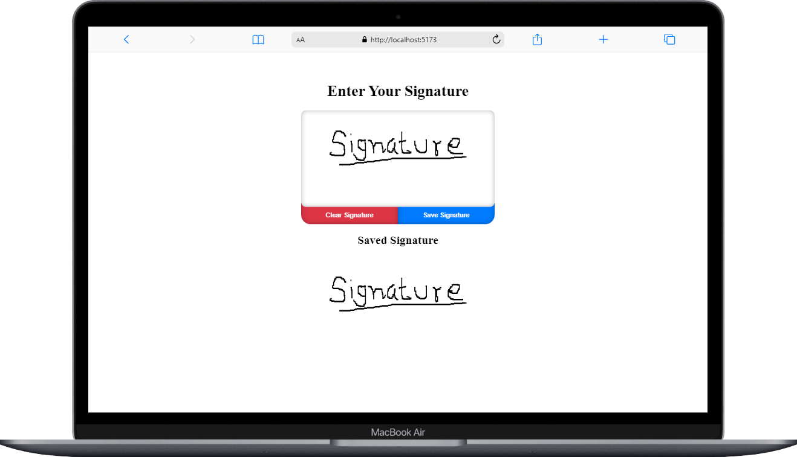
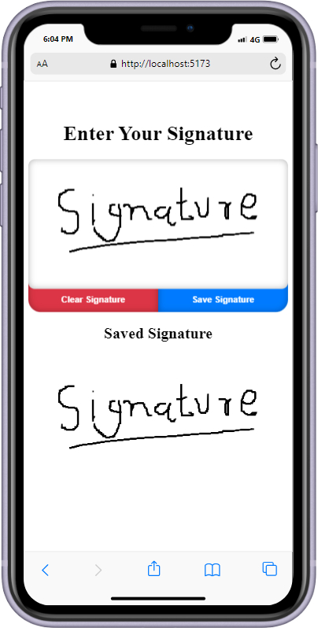

# React Signature Pad Canvas

React Signature Pad Canvas is a customizable React component for capturing signatures. Ideal for forms, contracts, and any application requiring user input.

<div style="display: flex; justify-content: center; gap: 20px; align-items: center;">
  
  
</div>


## Installation

You can install React Signature Pad Canvas via npm:

```bash
npm install react-signaturePadCanvas
```

## Usage

To use React Signature Pad Canvas in your React application, follow these steps:

1. **Import the Component and Styles**

   ```jsx
   import SignaturePad from 'react-signaturePadCanvas';
   import 'react-signaturePadCanvas/dist/SignaturePad.css'; // Import the default CSS
   ```

2. **Add the SignaturePad Component**

   ```jsx
   import React from 'react';
   import SignaturePad from 'react-signaturePadCanvas';
   import 'react-signaturePadCanvas/dist/SignaturePad.css'; // Import the default CSS

   function App() {
     const handleSaveImage = (dataUrl) => {
       console.log('Signature saved:', dataUrl);
     };

     return (
       <div className="App">
         <h1>Signature Pad</h1>
         <SignaturePad
           width={400}
           height={200}
           onSaveImage={handleSaveImage}
           theme="light" // or "dark"
           strokeColor="#000" // Customize stroke color
           style={{ border: '1px solid #ccc' }} // Customize container style
           clrBtnStyle={{ backgroundColor: '#dc3545', color: '#fff' }} // Customize clear button style
           saveBtnStyle={{ backgroundColor: '#007bff', color: '#fff' }} // Customize save button style
         />
       </div>
     );
   }

   export default App;
   ```

## Props

- **`width`** (`number`): Width of the signature pad (default is `300`).
- **`height`** (`number`): Height of the signature pad (default is `150`).
- **`style`** (`object`): Custom styles for the container of the signature pad.
- **`clrBtnStyle`** (`object`): Custom styles for the clear button.
- **`saveBtnStyle`** (`object`): Custom styles for the save button.
- **`onSaveImage`** (`function`): Callback function that receives the data URL of the saved signature.
- **`theme`** (`'light' | 'dark'`): Theme of the signature pad. Can be `light` or `dark` (default is `light`).
- **`strokeColor`** (`string`): Color of the signature stroke (default is `#000`).

## CSS Customization

You can customize the appearance of the signature pad by overriding the default CSS styles. The package includes a CSS file that you can import and modify as needed.

## License

This project is licensed under the MIT License - see the [LICENSE](LICENSE) file for details.

